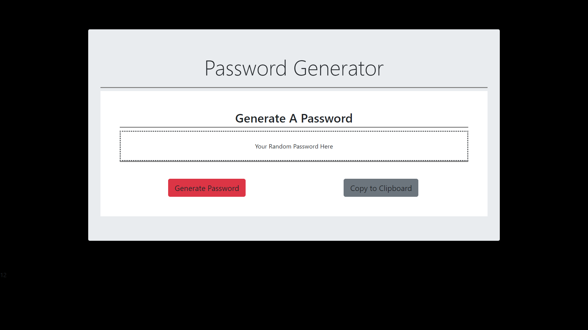

# Password-Generator

This was created as a homework assignment for my web development program. 

It generates a random password of user specified length and allows the user to copy 
it to their clipboard. 

Built with:
    * HTML 5
    * CSS 3
    * Bootstrap 4
    * Javascript

https://cng732.github.io/Password-Generator/

